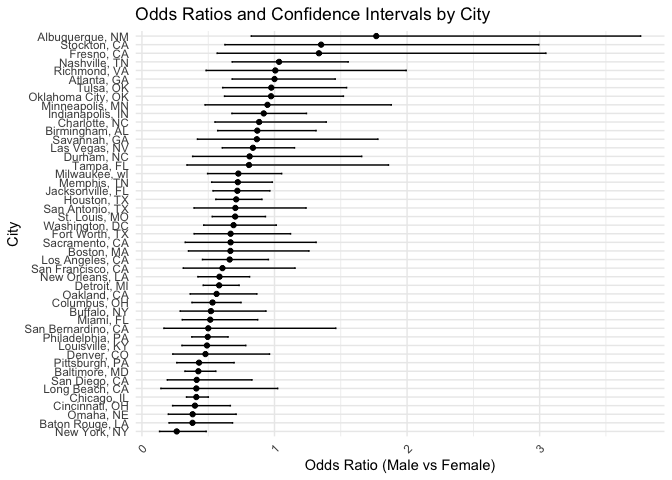

p8105_hw6_aw3621
================
Anni Wang
2024-12-02

``` r
library(rnoaa)
```

    ## The rnoaa package will soon be retired and archived because the underlying APIs have changed dramatically. The package currently works but does not pull the most recent data in all cases. A noaaWeather package is planned as a replacement but the functions will not be interchangeable.

``` r
library(dplyr)
```

    ## 
    ## Attaching package: 'dplyr'

    ## The following objects are masked from 'package:stats':
    ## 
    ##     filter, lag

    ## The following objects are masked from 'package:base':
    ## 
    ##     intersect, setdiff, setequal, union

``` r
library(ggplot2)
library(broom)
library(tidyverse)
```

    ## ── Attaching core tidyverse packages ──────────────────────── tidyverse 2.0.0 ──
    ## ✔ forcats   1.0.0     ✔ stringr   1.5.1
    ## ✔ lubridate 1.9.3     ✔ tibble    3.2.1
    ## ✔ purrr     1.0.2     ✔ tidyr     1.3.1
    ## ✔ readr     2.1.5

    ## ── Conflicts ────────────────────────────────────────── tidyverse_conflicts() ──
    ## ✖ dplyr::filter() masks stats::filter()
    ## ✖ dplyr::lag()    masks stats::lag()
    ## ℹ Use the conflicted package (<http://conflicted.r-lib.org/>) to force all conflicts to become errors

``` r
library(p8105.datasets)
library(ggplot2)
library(modelr)
```

    ## 
    ## Attaching package: 'modelr'
    ## 
    ## The following object is masked from 'package:broom':
    ## 
    ##     bootstrap

``` r
set.seed(1)
```

\###Problem 1

``` r
weather_df = 
  rnoaa::meteo_pull_monitors(
    c("USW00094728"),
    var = c("PRCP", "TMIN", "TMAX"), 
    date_min = "2017-01-01",
    date_max = "2017-12-31") %>%
  mutate(
    name = recode(id, USW00094728 = "CentralPark_NY"),
    tmin = tmin / 10,
    tmax = tmax / 10) %>%
  select(name, id, everything())
```

    ## using cached file: /Users/wanganni/Library/Caches/org.R-project.R/R/rnoaa/noaa_ghcnd/USW00094728.dly

    ## date created (size, mb): 2024-09-26 10:18:50.773147 (8.651)

    ## file min/max dates: 1869-01-01 / 2024-09-30

``` r
bootstrap_samples <- modelr::bootstrap(weather_df, 5000)

bootstrap_results <- bootstrap_samples %>%
  mutate(
    model = map(strap, ~ lm(tmax ~ tmin, data = as_tibble(.x))),
    r_squared = map_dbl(model, ~ broom::glance(.x)[["r.squared"]]),
    log_coef_product = map_dbl(model, ~ {
      coef_vals <- broom::tidy(.x) %>% pull(estimate)
      log(coef_vals[1] * coef_vals[2])
    })
  )

# Plotting results
bootstrap_results %>%
  ggplot(aes(x = r_squared)) +
  geom_density(fill = "blue", alpha = 0.5) +
  labs(title = "Distribution of R-squared from Bootstrap Samples",
       x = "R-squared",
       y = "Density") +
  theme_minimal()
```

<!-- -->

``` r
bootstrap_results %>%
  ggplot(aes(x = log_coef_product)) +
  geom_density(fill = "pink", alpha = 0.5) +
  labs(title = "Distribution of log(beta0 * beta1) from Bootstrap Samples",
       x = "log(beta0 * beta1)",
       y = "Density") +
  theme_minimal()
```

<!-- -->

``` r
# Confidence intervals
ci_r_squared <- quantile(bootstrap_results %>% pull(r_squared), c(0.025, 0.975))
ci_log_coef_product <- quantile(bootstrap_results %>% pull(log_coef_product), c(0.025, 0.975))

print(paste("95% CI for R-squared:", ci_r_squared[1], "-", ci_r_squared[2]))
```

    ## [1] "95% CI for R-squared: 0.893668412197251 - 0.927105964467631"

``` r
print(paste("95% CI for log(beta0 * beta1):", ci_log_coef_product[1], "-", ci_log_coef_product[2]))
```

    ## [1] "95% CI for log(beta0 * beta1): 1.9649486928301 - 2.05888745920792"

\###Problem 2

``` r
homicide_df = read_csv(file = "data/homicide-data.csv", na = c("Unknown", "NA", "")) |>
  mutate(reported_date = as.Date(as.character(reported_date), format = "%Y%m%d"))
```

    ## Rows: 52179 Columns: 12
    ## ── Column specification ────────────────────────────────────────────────────────
    ## Delimiter: ","
    ## chr (8): uid, victim_last, victim_first, victim_race, victim_sex, city, stat...
    ## dbl (4): reported_date, victim_age, lat, lon
    ## 
    ## ℹ Use `spec()` to retrieve the full column specification for this data.
    ## ℹ Specify the column types or set `show_col_types = FALSE` to quiet this message.

``` r
#Create a city_state variable (e.g. “Baltimore, MD”), and a binary variable indicating whether the homicide is solved.Omit cities Dallas, TX; Phoenix, AZ; and Kansas City, MO – these don’t report victim race. Also omit Tulsa, AL 
homicide_df <- homicide_df %>%
  mutate(
    city_state = str_c(city, state, sep = ", "),
    solved = if_else(disposition == "Closed by arrest", 1, 0),
    victim_age = as.numeric(victim_age)
  ) %>%
  filter(
    !city_state %in% c("Dallas, TX", "Phoenix, AZ", "Kansas City, MO", "Tulsa, AL"),
    victim_race %in% c("White", "Black")
  )
```

``` r
##For the city of Baltimore, MD, use the glm function to fit a logistic regression with resolved vs unresolved as the outcome and victim age, sex and race as predictors. 
baltimore_reg <- homicide_df |>
  filter(city_state == "Baltimore, MD")
logistic_model <- glm(solved ~ victim_age + victim_sex + victim_race, 
                      data = baltimore_reg, family = binomial())
```

``` r
##Save the output of glm as an R object; apply the broom::tidy to this object; and obtain the estimate and confidence interval of the adjusted odds ratio for solving homicides comparing male victims to female victims keeping all other variables fixed.
logistic_model %>%
  broom::tidy(conf.int = TRUE) %>%
  filter(term == "victim_sexMale") %>% 
  mutate(
    OR = exp(estimate),
    CI_low = exp(conf.low),
    CI_high = exp(conf.high)
  ) |> 
  select(OR, CI_low, CI_high)%>%
  knitr::kable(digits = 3)
```

|    OR | CI_low | CI_high |
|------:|-------:|--------:|
| 0.426 |  0.324 |   0.558 |

OR=0.426 with 95%CI (0.324,0.558)

``` r
##Now run glm for each of the cities in your dataset, and extract the adjusted odds ratio (and CI) for solving homicides comparing male victims to female victims. Do this within a “tidy” pipeline, making use of purrr::map, list columns, and unnest as necessary to create a dataframe with estimated ORs and CIs for each city.
eachcity <- homicide_df %>%
  group_by(city_state) %>%
  nest() %>%
  mutate(
    model = map(data, ~ glm(solved ~ victim_age + victim_sex + victim_race, data = ., family = binomial())),
    results = map(model, ~ tidy(., conf.int = TRUE) %>%
                   filter(term == "victim_sexMale") %>%
                   mutate(
                     OR = exp(estimate),
                     CI_low = exp(conf.low),
                     CI_high = exp(conf.high)
                   ) %>%
                   select(OR, CI_low, CI_high)
    )
  ) %>%
  unnest(results) %>%
  select(city_state, OR, CI_low, CI_high)
eachcity %>%
  knitr::kable(digits = 3)
```

| city_state         |    OR | CI_low | CI_high |
|:-------------------|------:|-------:|--------:|
| Albuquerque, NM    | 1.767 |  0.825 |   3.762 |
| Atlanta, GA        | 1.000 |  0.680 |   1.458 |
| Baltimore, MD      | 0.426 |  0.324 |   0.558 |
| Baton Rouge, LA    | 0.381 |  0.204 |   0.684 |
| Birmingham, AL     | 0.870 |  0.571 |   1.314 |
| Boston, MA         | 0.667 |  0.351 |   1.260 |
| Buffalo, NY        | 0.521 |  0.288 |   0.936 |
| Charlotte, NC      | 0.884 |  0.551 |   1.391 |
| Chicago, IL        | 0.410 |  0.336 |   0.501 |
| Cincinnati, OH     | 0.400 |  0.231 |   0.667 |
| Columbus, OH       | 0.532 |  0.377 |   0.748 |
| Denver, CO         | 0.479 |  0.233 |   0.962 |
| Detroit, MI        | 0.582 |  0.462 |   0.734 |
| Durham, NC         | 0.812 |  0.382 |   1.658 |
| Fort Worth, TX     | 0.669 |  0.394 |   1.121 |
| Fresno, CA         | 1.335 |  0.567 |   3.048 |
| Houston, TX        | 0.711 |  0.557 |   0.906 |
| Indianapolis, IN   | 0.919 |  0.678 |   1.241 |
| Jacksonville, FL   | 0.720 |  0.536 |   0.965 |
| Las Vegas, NV      | 0.837 |  0.606 |   1.151 |
| Long Beach, CA     | 0.410 |  0.143 |   1.024 |
| Los Angeles, CA    | 0.662 |  0.457 |   0.954 |
| Louisville, KY     | 0.491 |  0.301 |   0.784 |
| Memphis, TN        | 0.723 |  0.526 |   0.984 |
| Miami, FL          | 0.515 |  0.304 |   0.873 |
| Milwaukee, wI      | 0.727 |  0.495 |   1.054 |
| Minneapolis, MN    | 0.947 |  0.476 |   1.881 |
| Nashville, TN      | 1.034 |  0.681 |   1.556 |
| New Orleans, LA    | 0.585 |  0.422 |   0.812 |
| New York, NY       | 0.262 |  0.133 |   0.485 |
| Oakland, CA        | 0.563 |  0.364 |   0.867 |
| Oklahoma City, OK  | 0.974 |  0.623 |   1.520 |
| Omaha, NE          | 0.382 |  0.199 |   0.711 |
| Philadelphia, PA   | 0.496 |  0.376 |   0.650 |
| Pittsburgh, PA     | 0.431 |  0.263 |   0.696 |
| Richmond, VA       | 1.006 |  0.483 |   1.994 |
| San Antonio, TX    | 0.705 |  0.393 |   1.238 |
| Sacramento, CA     | 0.669 |  0.326 |   1.314 |
| Savannah, GA       | 0.867 |  0.419 |   1.780 |
| San Bernardino, CA | 0.500 |  0.166 |   1.462 |
| San Diego, CA      | 0.413 |  0.191 |   0.830 |
| San Francisco, CA  | 0.608 |  0.312 |   1.155 |
| St. Louis, MO      | 0.703 |  0.530 |   0.932 |
| Stockton, CA       | 1.352 |  0.626 |   2.994 |
| Tampa, FL          | 0.808 |  0.340 |   1.860 |
| Tulsa, OK          | 0.976 |  0.609 |   1.544 |
| Washington, DC     | 0.691 |  0.466 |   1.014 |

``` r
##Create a plot that shows the estimated ORs and CIs for each city. Organize cities according to estimated OR, and comment on the plot.

eachcity<- eachcity %>%
  arrange(OR)
ggplot(eachcity, aes(x = reorder(city_state, OR), y = OR)) +
  geom_point() +  # Add points for ORs
  geom_errorbar(aes(ymin = CI_low, ymax = CI_high), width = 0.2) +  
  coord_flip() +  
  labs(x = "City", y = "Odds Ratio (Male vs Female)", title = "Odds Ratios and Confidence Intervals by City") +
  theme_minimal() +  
  theme(axis.text.x = element_text(angle = 45, hjust = 1))
```

<!-- -->
Cities with an Odds Ratio (OR) greater than 1 suggest no significant
difference in the resolution rates between male and female victims.
Albuquerque, NM shows the highest OR along with the broadest 95%
confidence interval. Other cities like Stockton, CA, and Fresno, CA also
display notably high ORs above 1.

\##Promblem 3

``` r
#Load and clean the data for regression analysis
birthweight_df <- read_csv("data/birthweight.csv")
```

    ## Rows: 4342 Columns: 20
    ## ── Column specification ────────────────────────────────────────────────────────
    ## Delimiter: ","
    ## dbl (20): babysex, bhead, blength, bwt, delwt, fincome, frace, gaweeks, malf...
    ## 
    ## ℹ Use `spec()` to retrieve the full column specification for this data.
    ## ℹ Specify the column types or set `show_col_types = FALSE` to quiet this message.

``` r
birthweight_df <- birthweight_df %>%
  janitor::clean_names() %>%
  mutate(
    babysex = case_when(
      babysex == 1 ~ "male",
      babysex == 2 ~ "female"
    ),
    babysex = fct_infreq(babysex),
    frace = case_when(
      frace == 1 ~ "white",
      frace == 2 ~ "black",
      frace == 3 ~ "asian",
      frace == 4 ~ "puerto rican",
      frace == 8 ~ "other"
    ),
    frace = fct_infreq(frace),
    mrace = case_when(
      mrace == 1 ~ "white",
      mrace == 2 ~ "black",
      mrace == 3 ~ "asian",
      mrace == 4 ~ "puerto rican",
      mrace == 8 ~ "other"
    ),
    mrace = fct_infreq(mrace),
        malform = as.logical(malform)
  ) %>%
  drop_na()
```

``` r
#Propose a regression model for birthweight. 
bw_regression_model <- lm(bwt ~ babysex + bhead + blength + delwt + fincome + frace + gaweeks + malform + menarche + mheight + momage + mrace + parity + pnumlbw + pnumsga + ppbmi + ppwt + smoken + wtgain, data = birthweight_df)

summary(bw_regression_model)
```

    ## 
    ## Call:
    ## lm(formula = bwt ~ babysex + bhead + blength + delwt + fincome + 
    ##     frace + gaweeks + malform + menarche + mheight + momage + 
    ##     mrace + parity + pnumlbw + pnumsga + ppbmi + ppwt + smoken + 
    ##     wtgain, data = birthweight_df)
    ## 
    ## Residuals:
    ##      Min       1Q   Median       3Q      Max 
    ## -1097.68  -184.86    -3.33   173.09  2344.15 
    ## 
    ## Coefficients: (3 not defined because of singularities)
    ##                     Estimate Std. Error t value Pr(>|t|)    
    ## (Intercept)       -6265.3914   660.4011  -9.487  < 2e-16 ***
    ## babysexfemale        28.7073     8.4652   3.391 0.000702 ***
    ## bhead               130.7781     3.4523  37.881  < 2e-16 ***
    ## blength              74.9536     2.0217  37.075  < 2e-16 ***
    ## delwt                 4.1007     0.3948  10.386  < 2e-16 ***
    ## fincome               0.2898     0.1795   1.614 0.106551    
    ## fraceblack           14.3313    46.1501   0.311 0.756168    
    ## fracepuerto rican   -46.9962    44.6782  -1.052 0.292912    
    ## fraceasian           21.2361    69.2960   0.306 0.759273    
    ## fraceother            4.2969    74.0741   0.058 0.953745    
    ## gaweeks              11.5494     1.4654   7.882 4.06e-15 ***
    ## malformTRUE           9.7650    70.6259   0.138 0.890039    
    ## menarche             -3.5508     2.8951  -1.226 0.220083    
    ## mheight               9.7874    10.3116   0.949 0.342588    
    ## momage                0.7593     1.2221   0.621 0.534418    
    ## mraceblack         -151.4354    46.0453  -3.289 0.001014 ** 
    ## mracepuerto rican   -56.4787    45.1369  -1.251 0.210901    
    ## mraceasian          -91.3866    71.9190  -1.271 0.203908    
    ## parity               95.5411    40.4793   2.360 0.018307 *  
    ## pnumlbw                   NA         NA      NA       NA    
    ## pnumsga                   NA         NA      NA       NA    
    ## ppbmi                 4.3538    14.8913   0.292 0.770017    
    ## ppwt                 -3.4716     2.6121  -1.329 0.183913    
    ## smoken               -4.8544     0.5871  -8.269  < 2e-16 ***
    ## wtgain                    NA         NA      NA       NA    
    ## ---
    ## Signif. codes:  0 '***' 0.001 '**' 0.01 '*' 0.05 '.' 0.1 ' ' 1
    ## 
    ## Residual standard error: 272.5 on 4320 degrees of freedom
    ## Multiple R-squared:  0.7183, Adjusted R-squared:  0.717 
    ## F-statistic: 524.6 on 21 and 4320 DF,  p-value: < 2.2e-16

``` r
#Describe your modeling process and show a plot of model residuals against fitted values – use add_predictions and add_residuals in making this plot.
# Adding predictions and residuals to the dataset
birthweight_df <- birthweight_df %>%
  add_predictions(bw_regression_model) %>%
  add_residuals(bw_regression_model)

# Create a plot of residuals against fitted values
ggplot(birthweight_df, aes(x = pred, y = resid)) +
  geom_point(alpha = 0.5) + 
  geom_smooth(method = "loess", se = FALSE, color = "purple") +  
  labs(
    title = "Residuals vs Fitted Values",
    x = "Fitted Values (Predicted Birthweight)",
    y = "Residuals"
  ) +
  theme_minimal()
```

    ## `geom_smooth()` using formula = 'y ~ x'

<!-- -->
Description: The regression model predicts birthweight using variables
that reflect socioeconomic status and biological factors likely to
influence it. These variables include the family’s monthly income, the
duration of the pregnancy in weeks, the mother’s weight before
pregnancy, body mass index before pregnancy, any malformations affecting
birthweight, and the average number of cigarettes she smoked daily
during pregnancy. These predictors were chosen based on their relevance
to both the mother’s health and external socioeconomic factors. After
fitting the model, the summary was checked to assess the impact of each
predictor on birthweight and to understand the overall effectiveness of
the model in explaining the variation in birthweight.

``` r
#Compare your model to two others:
#One using length at birth and gestational age as predictors (main effects only)
#One using head circumference, length, sex, and all interactions (including the three-way interaction) between these

models <- list(
  model1 = lm(bwt ~ gaweeks + blength, data = birthweight_df),
  model2 = lm(bwt ~ bhead * blength * babysex, data = birthweight_df),
  model3 = lm(bwt ~ fincome + gaweeks + ppwt + ppbmi + malform + smoken, data = birthweight_df)
)
#Make this comparison in terms of the cross-validated prediction error; use crossv_mc and functions in purrr as appropriate.
cv_df <- crossv_mc(birthweight_df, 100) %>% 
  mutate(
    train = map(train, as_tibble),
    test = map(test, as_tibble)
  )

cv_df <- cv_df %>% 
  mutate(
    model1 = map(train, ~ lm(bwt ~ gaweeks + blength, data = .)),
    model2 = map(train, ~ lm(bwt ~ bhead * blength * babysex, data = .)),
    model3 = map(train, ~ lm(bwt ~ fincome + gaweeks + ppwt + ppbmi + malform + smoken, data = .))
  ) %>% 
  mutate(
    rmse_model1 = map2_dbl(model1, test, ~ rmse(model = .x, data = .y)),
    rmse_model2 = map2_dbl(model2, test, ~ rmse(model = .x, data = .y)),
    rmse_model3 = map2_dbl(model3, test, ~ rmse(model = .x, data = .y))
  )

cv_df %>% 
  select(starts_with("rmse")) %>% 
  pivot_longer(
    everything(),
    names_to = "model", 
    values_to = "rmse",
    names_prefix = "rmse_"
  ) %>% 
  mutate(model = fct_inorder(model)) %>% 
  ggplot(aes(x = model, y = rmse)) + 
  geom_violin() + 
  labs(title = "Comparison of Models", x = "Model", y = "RMSE")
```

<!-- -->

Model 1 shows a moderately wide range of RMSE values, primarily between
350 and 400, indicating a moderate prediction error with some
inconsistency across different validation splits. Model 2 displays the
lowest and most consistent RMSE, making it the most accurate model for
predicting birthweight from the given predictors. Model 3 presents the
most variable RMSE distribution, spanning from below 300 to over 400,
and appears bimodal, suggesting it might perform very differently
depending on the specific data it’s trained on, which could point to
overfitting or high sensitivity to the training data. The violin plot
analysis suggests that Model 2 is the optimal choice for its
consistently low and stable RMSE, showing it to be both effective and
dependable for prediction.
